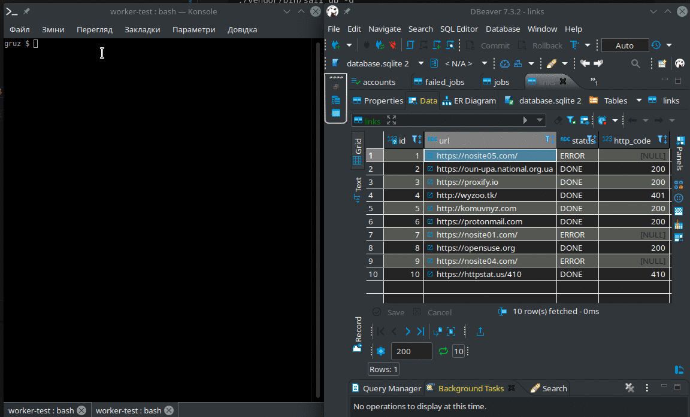
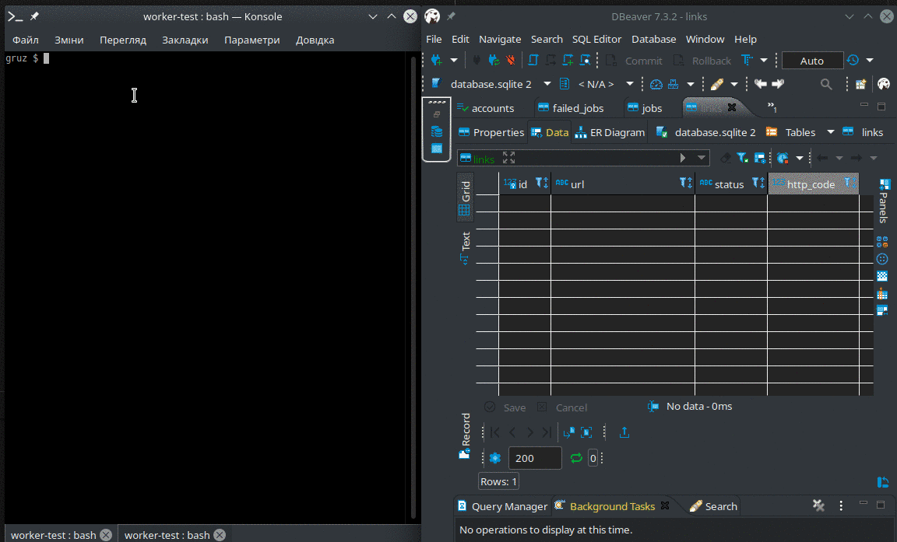

- [Task](#task)
- [Solution notes](#solution-notes)
  - [Queue driver problem](#queue-driver-problem)
- [Installation](#installation)
  - [Seeder](#seeder)
  - [Test using `sqlite` queue db connection](#test-using-sqlite-queue-db-connection)
  - [Test using `redis` (sail docker)](#test-using-redis-sail-docker)

## Task

In this exercise, you will write a distributed worker using a database table.
The worker requests each URL inside the table and stores the resulting response code.
Make sure you can run several workers in parallel. Each URL may only be requested once.

**Example table**

| id  | url                 | status | http_code |
| --- | ------------------- | ------ | --------- |
| 1   | https://example.com | DONE   | 200       |
| 2   | https://reddit.com  | NEW    | null      |

**Column definition**

| Column    | Description                                               |
| --------- | --------------------------------------------------------- |
| id        | Stores an incrementing identifier for the job             |
| url       | Stores a common URL                                       |
| status    | Contains one of the values NEW, PROCESSING, DONE or ERROR |
| http_code | Stores the resulting HTTP­code from the request.          |

**Definition of workflow**

* Get next available job
* Call the URL for the job
* Store the returned status

**Delivery**

* Use the language you are applying to.
* Send us a link to the repository where the code is stored. Preferably Github.

## Solution notes

### Queue driver problem

Native laravel queue processing using sqlite queue causes conflicts like
this while processing queues.

```
local.ERROR: SQLSTATE[HY000]: General error: 5 database is locked (SQL: update "jobs" set "reserved_at" = 1610315711, "attempts" = 1 where "id" = 14) {"exception":"[object] (Illuminate\\Database\\QueryException(code: HY000): SQLSTATE[HY000]: General error: 5 database is locked (SQL: update \"jobs\" set \"reserved_at\" = 1610315711, \"attempts\" = 1 where \"id\" = 14) at
```

A solution is to switch to `redis` for serving queues (or, maybe, latest MySQL, didn't test).

I tried using `sail` docker and resdis a and have no such a problem.
On the other hand, even with the exception throwen, everything works.

Here is a discuss: [Using `database` queue with several workers](https://github.com/laravel/framework/issues/7046#issuecomment-219724473)

So to test the solution we can use sqlite database as a lightweight environment but limiting queue workes for 2.

To avoid this problem, we must start `sail` docker.

## Installation

```bash
git clone git@github.com:gruz/testwork-laravel-worker.git
cd testwork-laravel-worker
bin/init
```

### Seeder

If you check the seeder at the factory, you can see it adds new records to the `links`
table as well as dispatching several same jobs per record to have several jobs
trying to update the same record.

### Test using `sqlite` queue db connection

This will run 2 workers

```
bin/test
```



### Test using `redis` (sail docker)

Change queue connection to redis

```bash
sed -i "s/QUEUE_CONNECTION=.*/QUEUE_CONNECTION=\"redis\"/" .env
```

Run docker and login into it

```bash
./vendor/bin/sail up -d
./vendor/bin/sail bash
```

After login to the docker run e.g. `bin/test 4`. `4` will mean 4 workers.



